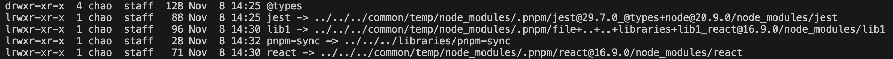
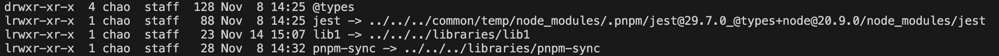

# pnpm-sync-demo

## Background

This repo is to demo the pnpm-sync command.<br>
You can check this [RFC](https://github.com/microsoft/rushstack/blob/octogonz/rfc-4320-rush-subspaces/common/docs/rfcs/rfc-4230-rush-subspaces.md) for learn more about the background.

## Instructions

### Folder structure

This demo repo is built with rush. We set up few sample apps and libs to mimic the situation.<br>
Under `apps` folder, we have three apps, `app1 and app2` have an injected workspace dependency `lib1`, `app3` has a normal workspace dependency `lib1`.<br>
The package.json for `app1 and app2`

```
{
  "dependencies": {
    "lib1": "workspace:*"
  },
  "dependenciesMeta": {
    "lib1": {
      "injected": true
    }
  },
}
```

The package.json for `app3`

```
{
  "dependencies": {
    "lib1": "workspace:*"
  }
}
```

Under `libraries` folder, the `lib1` is the sample lib used by apps.

### Run `rush install` to install all dependencies

You can check node_modules folder under each app to see the installation difference for injected dependencies and normal dependencies.<br>
For projects have the injected workspace dependency `lib1`, the `lib1` will link to pnpm store.

For projects have the normal workspace dependency `lib1`, the `lib1` will link to the source code.


### Run `rush after-install` to call `pnpm-sync --prepare` to generate the `pnpm-sync.json` file.

You can check `node_modules` folder under `lib1`, you will the `pnpm-sync.json` file, like below:

```
{
  "postbuildInjectedCopy": {
    "sourceFolder": "../..",
    "targetFolders": [
      {
        "folderPath": "../../../../common/temp/node_modules/.pnpm/file+..+..+libraries+lib1_react@16.0.0/node_modules/lib1"
      },
      {
        "folderPath": "../../../../common/temp/node_modules/.pnpm/file+..+..+libraries+lib1_react@16.9.0/node_modules/lib1"
      }
    ]
  }
}
```

This step will be integrated to `rush install` in the later milestone.

### Rush `rush build` to build the project

Normally, without injected dependencies, after this step, you can continue to the development. However, with injected dependencies, things are little different.<br>
Let's say, `app1` depends on `lib1`, and we made some changes on `lib1`. Now, we re-run the `rush build` to build the app again. We think the `app1` will use pick the latest changes from `lib1`, but it does not. <br>
This is due to `lib1` is an injected dependency, under `app1` node_modules folder, the `lib1` is not symlink to its source code location, but to the pnpm store location.<br>
Ok, how to fix it?

### Rush `pnpm-sync` under lib1

Now, we understand the problem, one solution is, we can copy the build output to all locations needed every time we build this project.<br>
Run `pnpm run pnpm-sync` under lib1, it will copy the build output to the target folders based on the `pnpm-sync.json` file we generated previously.

This step will be integrated to `rush build` in the later milestone.
